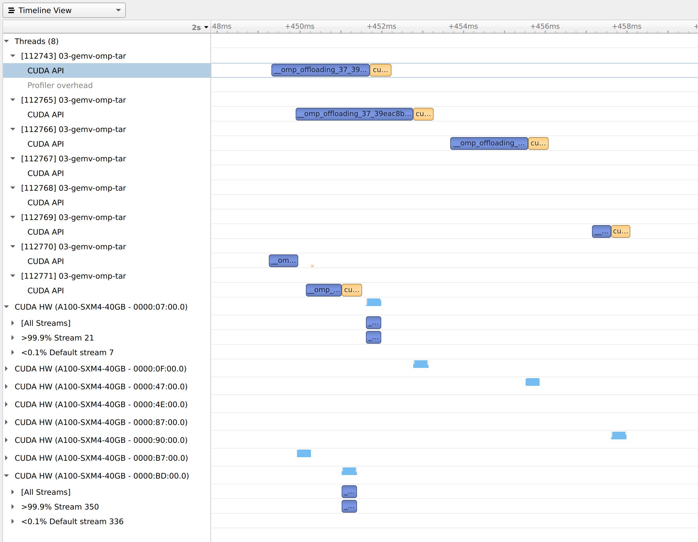

Last update 2021 May 3rd

Require only 1 GPU, use `single-gpu` queue
```
qsub -A Comp_Perf_Workshop -n 1 -t 60 -I -q single-gpu
```

Need to load llvm module on ThetaGPU
```
module load llvm/release-12.0.0
```

Case 1: offload one matrix-vector multiplication to a single GPU.

Case 2: offload multiple matrix-vector multiplication to a single GPU.
Multiple host threads launch target offload independently to keep GPU busy.


Case 3: offload multiple matrix-vector multiplication to multiple GPUs. Need `full-node` queue.
Multiple host threads launch target offload independently to on-node GPUs round-robin.

Need switching to the `full-node` queue to access the multiple GPUs with in a node


