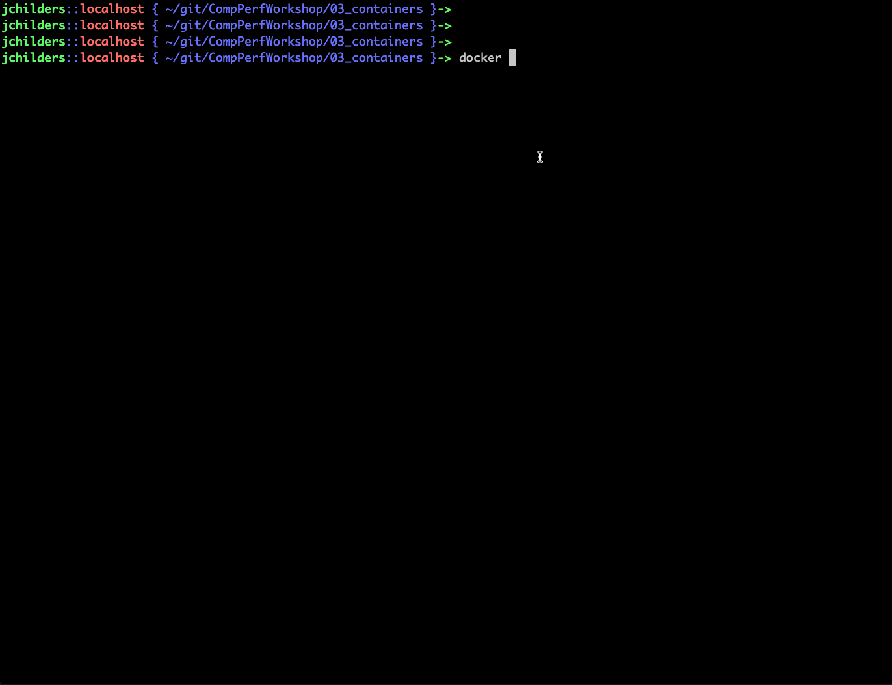

Contributors: Taylor Childers, Aditya Tanikanti, Romit Maulik

# Introduction to Containers

Containers are a method for shipping software that is pre-built inside a pre-defined static software environment. Ideally, a container can be copied from one system to another and the contained software run without changes to the installation. [Containers are often compared to virtual machines (VMs).](https://www.ibm.com/cloud/blog/containers-vs-vms)


This image aims to show the differences. VMs run a full software stack inside their environment, including hardware emulation and a full operating systems on top, in addition to the target software. Containers are lighter weight because they rely on the local operating sytsem to share the hardware with other containers. This lighter build typically also translates into better performance.

# Containers at ALCF

At ALCF, users must run [Singularity](https://sylabs.io/guides/3.8/user-guide/index.html) containers. Singularity is a container technology built for supercomputers with securtiy in mind. Typically we recommend users build [Docker](https://docs.docker.com/) containers first, which can then be easily converted to Singularity containers. Below you'll find links to instructions for each of our systems.

We will not repeat the detailed instructions for building docker containers, but do provide system specific examples of what a `Dockerfile` should look like. 
* General Docker documentation can be found here: https://docs.docker.com/
* Specifics on building docker container recipes using `Dockerfile` can be found here: https://docs.docker.com/engine/reference/builder/

The trickiest parts of building containers for ALCF systems is ensuring proper MPI support and GPU driver compatibility.

# Building your first container

The easiest way to build a container is from your laptop. [First, install Docker.](https://docs.docker.com/get-docker/) Then follow these steps.

We have an example installation in the [Local](/03_containers/Local) directory, which contains an `Dockerfile`. This is a container recipe file that we will use to tell Docker how to install our software.

## Example `Dockerfile`

We include example build source code here: [Local Example Source](Local/source). This includes an example [Dockerfile](Local/Dockerfile) which we will describe line-by-line below.

```Dockerfile
FROM ubuntu:20.04
```
The first line specifies a starting point for our contianer. In this instance, we start from a container that only has Ubuntu version 20.04 installed. However, we could start with any other container available on Docker Hub. We'll build everything else on top of this operating system.

```Dockerfile
RUN apt-get update -y \
	&& DEBIAN_FRONTEND=noninteractive \
	&& apt-get install -y build-essential libfabric-dev libibverbs-dev gfortran wget \
        && apt-get install -y python3 python3-distutils python3-pip gcc
```

Here we install system packages we need to build and run our code examples using the standard [Ubuntu package manager](https://ubuntu.com/server/docs/package-management#:~:text=The%20apt%20command%20is%20a,upgrading%20the%20entire%20Ubuntu%20system.) `apt`.

```Dockerfile
WORKDIR /mpich
# Source is available at http://www.mpich.org/static/downloads/
# See installation guide of target MPICH version
# Ex: https://www.mpich.org/static/downloads/4.0.2/mpich-4.0.2-installguide.pdf
# These options are passed to the steps below
ARG MPICH_VERSION="3.3"
ARG MPICH_CONFIGURE_OPTIONS="--prefix=/mpich/install --disable-wrapper-rpath"
ARG MPICH_MAKE_OPTIONS="-j 4"
RUN wget http://www.mpich.org/static/downloads/${MPICH_VERSION}/mpich-${MPICH_VERSION}.tar.gz \
      && tar xfz mpich-${MPICH_VERSION}.tar.gz  --strip-components=1 \
      && ./configure ${MPICH_CONFIGURE_OPTIONS} \
      && make install ${MPICH_MAKE_OPTIONS}
ENV PATH $PATH:/mpich/install/bin
ENV LD_LIBRARY_PATH $LD_LIBRARY_PATH:/mpich/install/lib
```

Here we change our working directory to `/mpich` and then download and install MPI from scratch with some specific build options. You can find the installation documentation [HERE](https://www.mpich.org/static/downloads/4.0.2/mpich-4.0.2-installguide.pdf). The key compilation option is the `--disable-wrapper-rpath` which makes it possible to build applications inside the container using this MPI library, but then replace those libraries with the Theta-specific libraries during runtime simply using the `LD_LIBRARY_PATH` environment variable. This is important since Theta uses high-speed network interfaces that require custom drivers and interface libraries to use.

```Dockerfile
RUN pip install mpi4py
```

Here we simply install `mpi4py` into our python environment and it will utilize the MPICH we installed.

```Dockerfile
WORKDIR /usr
COPY source/* /usr/source/
COPY submit.sh /usr/
RUN chmod +x /usr/submit.sh
RUN mpicc -o /usr/source/mpi_hello_world /usr/source/mpi_hello_world.c
```

Next we copy the [source/](/03_containers/Local/source) code examples from our repo (paths are with respect to the location of the `Dockerfile`) into our containers filesystem and build the C-file into a binary we can later execute on Theta.

```Dockerfile
ENTRYPOINT ["/usr/submit.sh"]
```

In Docker (and Singularity) you can simply "run" a container if an entry point is defined, so calling `docker run <container-name>` in this recipe executes our `submit.sh` script. Otherwise we can be more explicit can call any binary in our container using `docker exec <container-name> <command>`.

## Building the Docker Image and Upload to Docker Hub

Side Note: 
Docker uses the terms "image" and "contianer" this way: 'images' are a static software environment from which 'containers' can be launched and created. For instance, I would have one image named `my_analysis_app` which contains my applications. However, this application can be run on multiple input data files in parallel. I can therefore use this image to launch multiple concurrent 'containers' and provide each one with different input data. Each 'container' is an isolated application running. They can be 'started' and 'stopped' or 'restarted'. I can 'enter' these containers interactively and do things to the running environment, e.g. `apt install python`, but when my container stops running all these changes are gone. Only changes to the base image last (though you can create a new image from a running container).

The first step is to create Docker Hub account here: [DockerHub Hub](https://hub.docker.com/). Then follow these steps.

Create a Docker Hub Repository:


Then build your Image:

```bash
# build image from Dockerfile, include the path to the folder that contains the Dockerfile
cd /path/to/CompPerfWorkshop/03_containers
docker build -t jtchilders/alcf_cwp_example:latest ./Local/
```
Here you see my username and repository name `jtchilders/alcf_cwp_example` and then attached with a `:` is the "tag" for this image. Just like GitHub, an image is tagged with a version. It's traditional in Docker to use `latest` for the most recent version, but otherwise, you can use any string you like.

Then `./Local/` simply points to the folder which contains my `Dockerfile`. The build recipe will be run in that folder and have access to all the source files inside. As an example, the instructions to build images for Theta(KNL) and Theta(GPU) are different. In order to build the image for Theta(GPU) you need to use the `Dockerfile_thetagpu` and must change the build command so it knows to use this file instead of the default:

```bash
docker build -t jtchilders/alcf_cwp_example:thetagpu -f ./Local/Dockerfile_thetagpu ./Local/
```

In this case, I'm still naming the image with my `username/repo` but I've changed my tag name to `thetagpu` so I can distinguish it from the previous image we built. I've also instructed docker on which `Dockerfile` to use as the recipe.

Last step is to make this image accessible on Theta, so we'll push the newly built image to Docker Hub using:
```bash
docker push jtchilders/alcf_cwp_example:latest
docker push jtchilders/alcf_cwp_example:thetagpu
```

Quick demo:



## Building Singularity images from Docker images

Anywhere singularity is installed, for instance on the Theta login nodes, you can run a build command based off a docker image using:
```bash
singularity build my_image.simg docker://jtchilders/alcf_cwp_example
```
This will create a local file called `my_image.simg` based on the docker image we created above.


# System Specific Instructions

* [Containers on Theta (KNL)](Theta/)
* [Containers on Theta (GPU)](ThetaGPU/)
