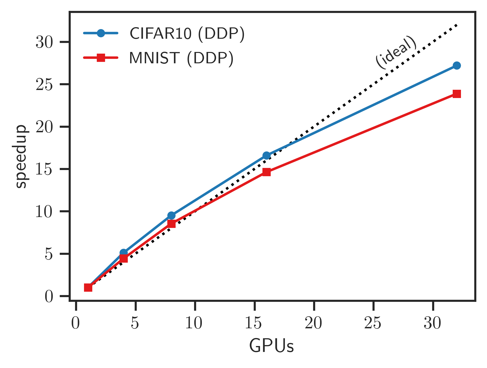

# Distributed training with PyTorch DDP

---

#### Table of Contents

- [Distributed training with PyTorch DDP](#distributed-training-with-pytorch-ddp)
  * [What is DDP?](#what-is-ddp)
  * [How does DDP work?](#how-does-ddp-work)
  * [DDP Support](#ddp-support)
      - [Using Containers](#using-containers)
      - [Running Locally](#running-locally)
  * [Setting up DDP](#setting-up-ddp)
  * [Hands-On: Running on ThetaGPU](#hands-on-running-on-thetagpu)
  + [Example Performance](#example-performance)
  * [Additional References](#additional-references)

---

**Author:** Sam Foreman [foremans@anl.gov](mailto:foremans@anl.gov)

**Note**:  Adapted from original material [here](https://github.com/argonne-lcf/sdl_ai_workshop/blob/master/01_distributedDeepLearning/DDP/README.md), written by Corey Adams ([corey.adams@anl.gov](mailto:corey.adams@anl.gov)) and Huihuo Zheng ([huihuo.zheng@anl.gov](mailto:huihuo.zheng@anl.gov))

- **Goal:** 

  1. Understand how PyTorch's DDP works

  2. Learn how to initialize DDP and select a communication backend (`NCCL` for GPUs, `gloo` for CPUs)

  3. Be able to modify existing code to be compatible with DDP

---

## What is DDP?

Pytorch has an additional built-in distributed data parallel package, DDP, short for "Distributed Data Parallel". It comes in `pytorch>=1.6`, and wraps your model (**not** your optimizer, like `horovod`) and performs computation and communication simultaneously.

Here is the pytorch documentation: https://pytorch.org/tutorials/intermediate/ddp_tutorial.html

And their paper about this: https://arxiv.org/abs/2006.15704

DDP is known to scale (_almost_) linearly, meaning it would take roughly half as long to train a model across two GPUs as it would to train it on a single GPU.

## How does DDP work?

DDP works by creating separate python processes for each GPU, with each process receiving a disjoint set of the training data. 

For each of these processes, DDP wraps your model and figures out what tensors need to be allreduced and when. It leverages the situations where, during a sequential backward pass, the earliest tensors to be used going backwards (which are the latest in the model!) are ready for an allreduce operation much sooner than the latest tensors (which are the first in the model!). So, during the bakcwards pass the allreduce of tensors that are no longer needed in the graph will happen while the backwards pass is still computing.

Additionally, DDP performs tensor fusion to create larger buffers for tensors. Horovod also has the option, though DDP uses it by default.

For collective communication, DDP can use `NCCL` on GPUs, and `gloo` on CPUs.

## DDP Support

#### Using Containers

Running DDP inside Nvidia's docker or singularity containers was covered at the [ALCF: Simulation, Data, and Learning Workshop for AI: 01--Distributed Deep Learning](https://github.com/argonne-lcf/sdl_ai_workshop), so we will not repeat that tutorial here.

#### Running Locally

Instead, we provide examples using DDP with a native PyTorch installation on ThetaGPU.

## Setting up DDP

To start DDP, you need to call pytorch's `init_process_group` function from the `distributed` package. In order to do this, we need to specify a backend.

For training on multiple GPUs, we can use the `NCCL` backend. If NCCL is unavailable it will fallback to the default `gloo` backend, which should also work for training on CPUs.

We provide below a snippet from [`./torch_ddp_mnist.py`](./torch_ddp_mnist.py)

```python
import sys
import os
import torch.nn as nn
from torch.nn.parallel import DistributedDataParallel as DDP
import torch.optim as optim
import torch.distributed as dist

# Add `../utils/` to `sys.path`
here = os.path.abspath(os.path.dirname(__file__))
modulepath = os.path.dirname(here)
if modulepath not in sys.path:
    sys.path.append(modulepath)
    
# import helper functions
from utils.data_torch import prepare_datasets
from utils.parse_args import parse_args_ddp
    

def main(args):
    with_cuda = torch.cuda.is_available()
    backend = 'nccl' if with_cuda else 'gloo'
    dist.init_process_group(backend=backend)
    local_rank = args.local_rank
    world_size = 1 if not dist.is_available() else dist.get_world_size()
    
    # Setup our simple model
    # Note: `Net()` is defined in `05_scaling-DL/DDP/torch_ddp_mnist.py`
    model = Net()
    
    # Setup the device that will run our model.
    # Note: DDP will automatically pass `--local_rank` as an argument to our script
    if with_cuda:
        if world_size > 1:
            device = torch.device(f'cuda:{args.local_rank}')
        else:
            device = torch.device('cuda')
            
        # Encapsulate the model on the GPU assigned to the current process
        model = model.to(device)
        ddp_model = DDP(model,
                        device_ids=[args.local_rank],
                        output_device=args.local_rank)
    else:
        device = torch.device('cpu')
        ddp_model = DDP(model)
    
    # Prepare MNIST data using helper function from `utils.data_torch`
    data = prepare_datasets(args, rank=local_rank,
                            num_workers=world_size,
                            data='mnist')
    loss_fn = nn.CrossEntropyLoss()
    optimizer = optim.Adam(ddp_model.parameters(),
                           lr=args.lr * world_size,
                           weight_decay=1e-5)
    
    for epoch in range(args.epochs):
        # Note: the `train` function is defined in
        # `05_scaling-DL/DDP/torch_ddp_mnist.py`
        train(epoch, data['training'],
              device=device, rank=local_rank, model=ddp_model,
              loss_fn=loss_fn, optimizer=optimizer, args=args)
        
if __name__ == '__main__':
    args = parse_args_ddp()
    main(args)
```

## Hands-On: Running on ThetaGPU

1. Login to Theta:

   ```bash
   # to theta login node from your local machine
   ssh username@theta.alcf.anl.gov
   ```

2. Login to ThetaGPU service node (this is where we can submit jobs directly to ThetaGPU):

   ```bash
   # to thetaGPU service node (sn) from theta login node
   ssh username@thetagpusn1
   ```

3. Submit an interactive job to ThetaGPU

   ```bash
   # should be ran from a service node, thetagpusn1 
   qsub -I -A Comp_Perf_Workshop -q training -n 1 -t 00:30:00 -O ddp_tutorial --attrs=pubnet=true
   ```

4. Once your job has started, load the `conda/pytorch` module and activate the base conda environment

   ```bash
   module load conda/pytorch
   conda activate base
   ```

5. Clone the `CompPerfWorkshop-2021` github repo (if you haven't already):

   ```bash
   git clone https://github.com/argonne-lcf/CompPerfWorkshop-2021
   ```

6. Download the MNIST dataset using the provided script:

   ```bash
   cd CompPerfWorkshop-2021/05_scaling-DL
   # Download the MNIST dataset
   mkdir datasets
   ./download_mnist.sh
   ```

7. To launch DDP using 8 workers on a ThetaGPU node, we use the command:

   ```bash
   python3 -m torch.distributed.launch --nproc_per_node=8 --nnodes=1 --node_rank 0 \
   	./DDP/torch_ddp_mnist.py --gpu --lr=0.001 --batch_size=256 --epochs=50
   ```

8. **NOTE:** To safely shutdown the distributed training instance, we can use the command:

   ```bash
   kill $(ps aux | grep torch_ddp_mnist.py | grep -v grep | awk '{print #2}')
   ```

## Example Performance

Here I show the results I got measuring the `time-per-epoch` averaged over the last 5 epochs of a training run. I scaled out over a single node, and out onto 4 nodes x 8 GPUs

| GPUs | Cifar10 Time/epoch [s] | MNIST Time/epoch [s] |
| :--: | ---------------------: | -------------------: |
|  1   |                   13.6 |                 11.7 |
|  4   |                   2.66 |                 2.64 |
|  8   |                   1.43 |                 1.37 |

| Nodes | CIFAR10 Time / epoch [s] | MNIST Time / epoch [s] |
| :---: | -----------------------: | ---------------------: |
|   1   |                     1.43 |                   1.37 |
|   2   |                     0.82 |                   0.80 |
|   4   |                     0.50 |                   0.49 |



## Additional References

[1] https://leimao.github.io/blog/PyTorch-Distributed-Training/

[2] https://oboiko.medium.com/distributed-training-with-pytorch-d1fa5f57b40
