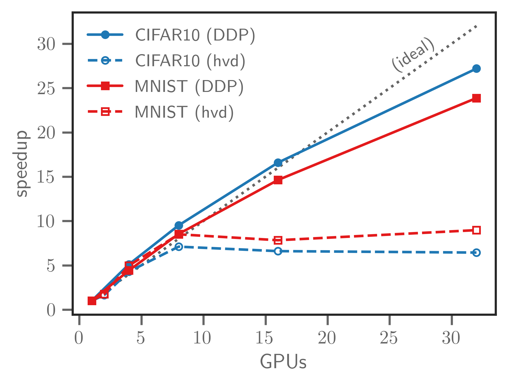

# Scaling Deep Learning Applications

---

Computational Performance Workshop @ ALCF 2021

Author: Sam Foreman ([foremans@anl.gov](mailto:foremans@anl.gov)), Huihuo Zheng ([huhuo.zheng@anl.gov](mailto:huihuo.zheng@anl.gov)), Corey Adams ([corey.adams@anl.gov](mailto:corey.adams@anl.gov))

This section of the workshop will introduce you to some of the tools we use to run distributed deep learning training at ALCF.

**Note**: This topic was also covered at the [ALCF: Simulation, Data, and Learning Workshop for AI](https://github.com/argonne-lcf/sdl_ai_workshop) workshop. You can find additional resources (+ examples) here [sdl_ai_workshop/01_distributedDeepLearning](https://github.com/argonne-lcf/sdl_ai_workshop/blob/master/01_distributedDeepLearning/README.md)

---

#### Contents

- [Horovod](./horovod/README.md)
  - [tensorflow](./horovod/tensorflow/README.md)
    - [tf2_hvd_mnist.py](./horovod/tensorflow/tf2_hvd_mnist.py)
  - [torch](./horovod/torch/README.md)
    - [torch_hvd_mnist.py](./horovod/torch/torch_hvd_mnist.py)
- [DDP](./DDP/README.md)
  - [torch_ddp_mnist.py](./DDP/torch_ddp_mnist.py)
- [utils](./utils/README.md)
  - [io.py](./utils/io.py)  (Helper functions for creating datasets, logging metrics, etc.)
  - [parse_args.py](./utils/parse_args.py) (Helper functions for parsing command line arguments)
  - [data_torch.py](./utils/data_torch.py) (Helper functions for dealing with datasets in `torch`)

---

### Simple Scaling Comparison

<!------>

