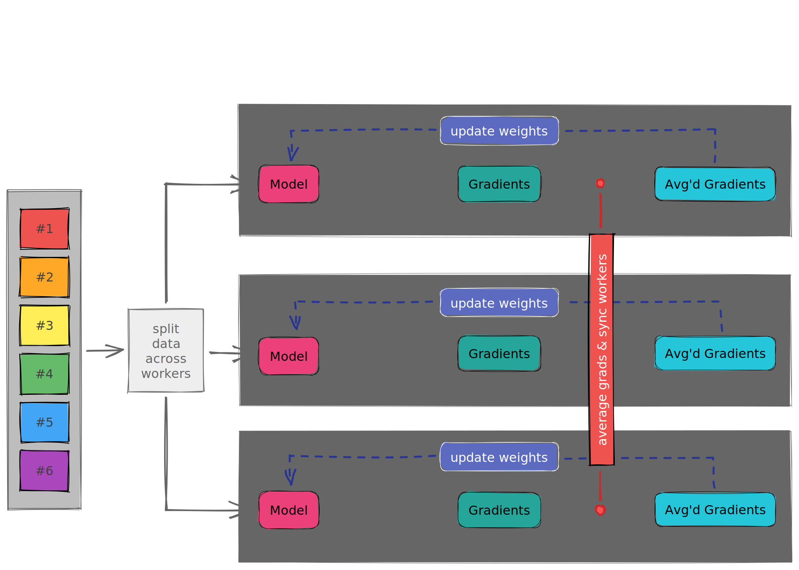
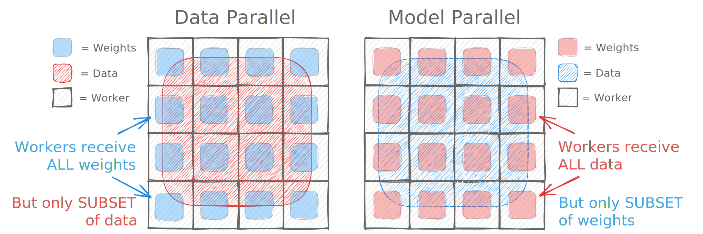
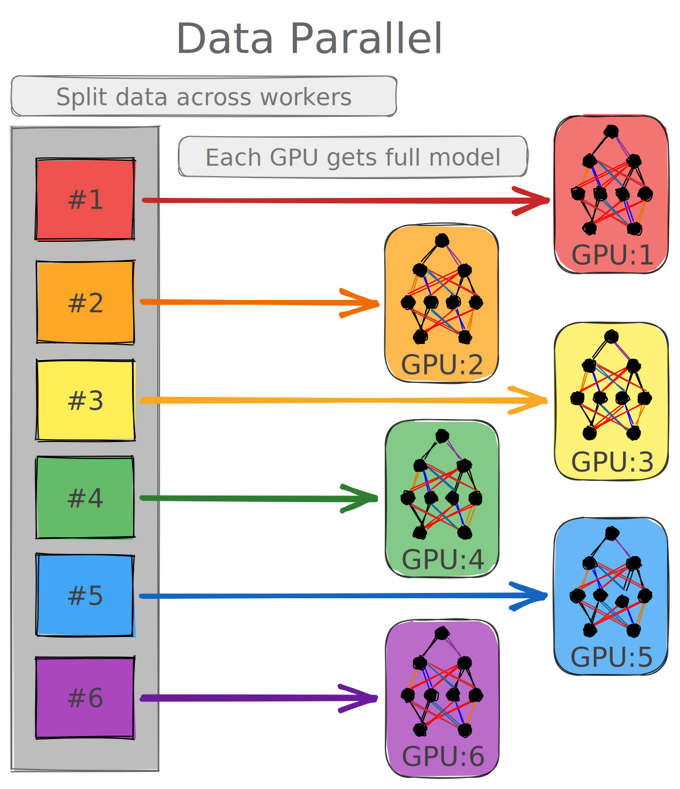
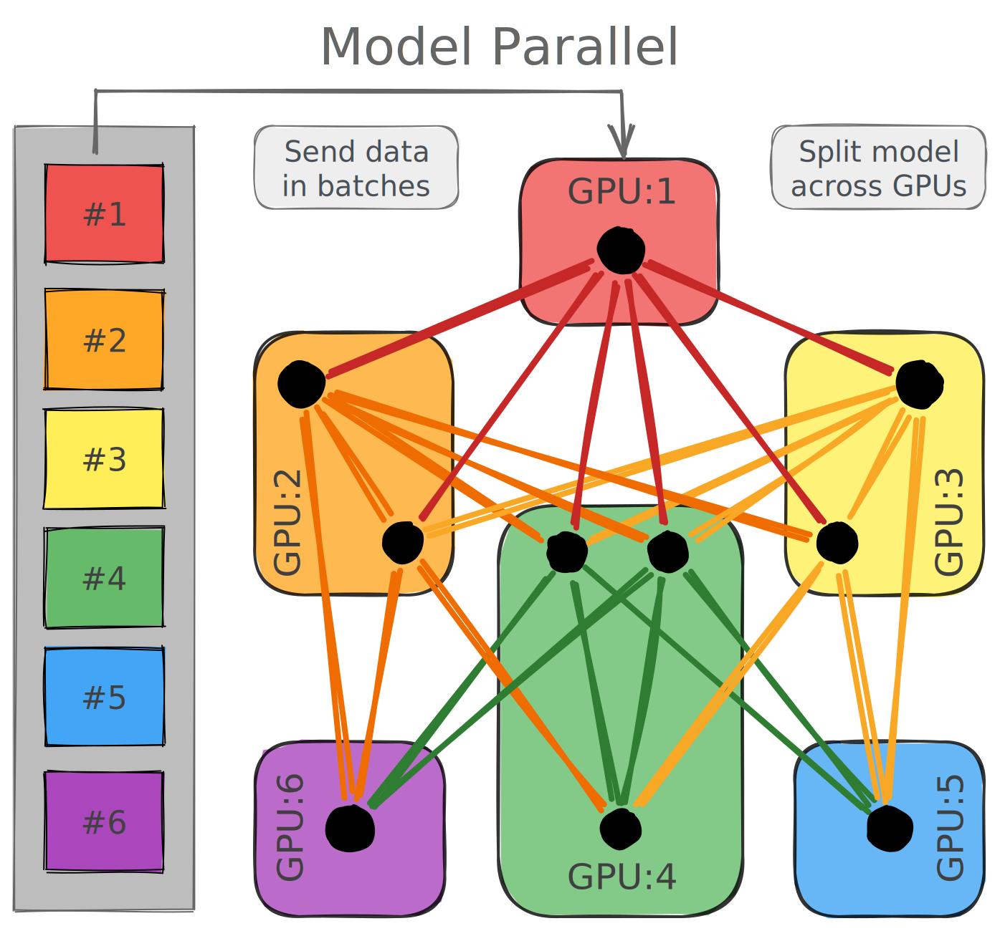

# Scaling Deep Learning Applications

Computational Performance Workshop @ ALCF 2022

**Authors:** [Sam Foreman](samforeman.me) ([foremans@anl.gov](mailto:///foremans@anl.gov)), Huihuo Zheng [huihuo.zheng@anl.gov](mailto:///huihuo.zheng@anl.gov) 

This section of the workshop will introduce you to some of the tools that we use to run distributed deep learning training at ALCF.

**Note:** This topic was also covered at the [ALCF: Simulation, Data, and Learning Workshop for AI](https://github.com/argonne-lcf/sdl_ai_workshop), which has additional resources ( + examples) for those interested.

> ‼️ **Warning**
>   The examples below use [hydra](https://hydra.cc/) to manage experiment configuration.
> In order to use hydra with the provided `conda` environment, repeat the following steps:
> 1. `qsub -I -A Comp_Perf_Workshop -q single-gpu -t 01:00 -n 1`
> 2. `module load conda/2021-11-30`
> 3. `conda activate base`
> 4. `python3 -m pip install hydra-core hydra_colorlog --upgrade`

## Organization
1. [Distributed Training](#distributed-training) 📍
    1. [Why train on multiple GPUs](#why-train-on-multiple-gpus)
    2. [Model vs Data Parallelism](#model-vs-data-parallelism)
        1. [Model Parallelism](#model-parallelism)
        2. [Data Parallelism](#data-parallelism)
2. [Horovod](./src/cpw/horovod/README.md) 
    1. [Horovod with TensorFlow](./src/cpw/horovod/tensorflow/README.md)
        1. [`horovod/tensorflow/main.py`](.src/cpw/horovod/tensorflow/main.py)
    3. [Horovod with PyTorch](./src/cpw/horovod/torch/README.md)
        1. [`horovod/pytorch/main.py`](./src/cpw/horovod/torch/main.py)
5. [PyTorch DistributedDataParallel](./src/cpw/DDP/README.md)
    1. [`DDP/main.py`](./src/cpw/ddp/main.py)
6. [DeepSpeed](./src/cpw/deepspeed/README.md)
    1. [`deepspeed/main.py`](./src/cpw/deepspeed/main.py)

# Distributed Training

## Why train on multiple GPUs?
- Large batches may not fit in GPU memory
- Splitting the data across workers has the effect of increasing the batch size, which has the effect of:
    - Smoothing the loss landscape
    - Improved gradient estimators
    - Less iterations for the same number of epochs
        - May need to train for more epochs if another change is not made like boosting the learning rate
    - See [Large Batch Training of Convolutional Networks](https://arxiv.org/abs/1708.03888)

   
   
|   Year   |       Author       |        Batch Size         |         Processor       | DL Library |     Time     |   Accuracy |
|:--------:|:------------------:|:-------------------------:|:-----------------------:|:----------:|:------------:| ----------:|
| **2016** |   He et al. [1]    |            256            |       Tesla P100 x8     |   Caffe    |    29 Hrs    |      75.3% |
|          |  Goyal et al. [2]  |           8192            |       Tesla P100        |  Caffe 2   |    1 hour    |      76.3% |
|          |  Smith et al. [3]  |       8192 ->  16,384     |       full TPU pod      | TensorFlow |   30 mins    |      76.1% |
|          |  Akiba et al. [4]  |          32,768           |     Tesla P100 x1024    |  Chainer   |   15 mins    |      74.9% |
|          |   Jia et al. [5]   |          65,536           |     Tesla P40  x2048    | TensorFLow |   6.6 mins   |      75.8% |
|          |  Ying et al. [6]   |          65,536           |       TPU v3 x1024      | TensorFlow |   1.8 mins   |      75.2% |
|          | Mikami et al. [7]  |          55,296           |     Tesla V100 x3456    |    NNL     |   2.0 mins   |     75.29% |
| **2019** | **Yamazaki et al** |        **81,920**         |  **Tesla V100 x 2048**  | **MXNet**  | **1.2 mins** | **75.08%** |

For additional information / general guidance, refer to [Writing Distributed Applications with PyTorch](https://pytorch.org/tutorials/intermediate/dist_tuto.html), or see[^1], [^2], [^3].

From [PyTorch Distributed Overview — PyTorch Tutorials 1.11.0 documentation](https://pytorch.org/tutorials/beginner/dist_overview.html)[^ddp]:

<blockquote>
    <b>For apps that gradually grow from simple to complex and from prototype to production, the common development trajectory may be:</b>
    <ol>
        <li> ❌ Use single device training if the data and model can fit on one GPU, and training speed is not a concern  (not relevant for this section)</li>
        <li> ❌ Use single-machine multi-GPU <a href="https://pytorch.org/docs/stable/generated/torch.nn.DataParallel.html"> `DataParallel` </a>  to make use of multiple GPUs on a single machine to speed up training with minimal code changes (not recommended, <tt>DDP</tt> preferred) </li>
        <li> ✅ Use single-machine multi-GPU <a href="https://pytorch.org/docs/stable/generated/torch.nn.parallel.DistributedDataParallel.html"> <tt>DistributedDataParallel</tt>  </a>  if you would like to further speed up training and are willing to write a little more code to set it up </li>
        <li> ✅ Use multi-machine <a href="https://pytorch.org/docs/stable/generated/torch.nn.parallel.DistributedDataParallel.html"><tt>DistributedDataParallel</tt></a> and the <a href="https://github.com/pytorch/examples/blob/master/distributed/ddp/README.md"> launching script</a> if the application needs to scale across machine boundaries </li>
        <li> ❓ Use <a href="https://pytorch.org/docs/stable/distributed.elastic.html"> <tt>torch.distributed.elastic</tt></a> to launch distributed training if errors (e.g., out-of-memory) are expected or if resources can join and leave dynamically during training  (not covered in this tutorial) </li>
    </ol>
</blockquote>

## Model vs Data Parallelism

### Model Parallelism

- In this scheme, disjoint subsets of a neural network are assigned to different devices.
    - All computation associated with the subsets are distributed
- Communication happens between devices whenever there is dataflow between two subsets
- Typically more complicated to implement than data parallel training
- Suitable when the model is too large to fit onto a single device (CPU / GPU) because of the memory capacity
    - Partitioning the model into different subsets is not an easy task
    - Might potentially introduce load imbalancing issues limiting the scaling efficiency
- 🤗[huggingface/transformers](https://github.com/huggingface/transformers) is a useful reference, and they have an excellent series of posts in their documentation on [Model Parallelism](https://huggingface.co/docs/transformers/parallelism)
    
### Data Parallelism

- Typically easier / simpler to implement
- Existing frameworks ([Horovod](https://horovod.readthedocs.io/en/stable/index.html), [DeepSpeed](https://github.com/microsoft/DeepSpeed), [DDP](https://pytorch.org/docs/stable/notes/ddp.html), etc.)
    - Typically relatively simple to get up and running (minor modifications to existing code)
- All of the workers own a replica of the model
- The global batch of data is split into multiple mini-batches and processed by different workers
- Each worker computes the corresponding loss and gradients with respect to the data it processes
- Before updating of the parameters at each epoch, the loss and gradients are averaged across all workers through a collective operation
    - Relatively simple to implement, `MPI_Allreduce` is the only communication operation required
    - [Concepts — Horovod documentation](https://horovod.readthedocs.io/en/stable/concepts_include.html)
- Our recent presentation on data-parallel training is available on [youtube](https://youtu.be/930yrXjNkgM) 
- In the data-parallel approach, all workers own a replica of the model. The global batch of data is split into multiple minibatches, as shown in the figure below, and processed by different workers.
- Each worker computes the corresponding loss and gradients with respect to the local data it possesses. Before updating the parameters at each epoch, the loss and gradients are averaged among all the workers through a collective `allreduce` operation.
    - `MPI` defines the function `MPI_Allreduce` to reduce values from all ranks and broadcast the result of the reduction such that all processes have a copy of it at the end of the operation.
    - There are multiple different ways to implement the allreduce, and it may vary from problem to problem[^4], [^5]
    

## Best Practices
> :warning: **Computation stalls during communication!**
>  
> Keeping the communication to computation ratio small is important for effective scaling

Some general good practices that will be important for upcoming architectures (e.g. [Aurora](https://alcf.anl.gov/aurora), [Polaris](https://alcf.anl.gov/polaris), etc.)[^6]
1. Use parallel IO whenever possible
    1. Could feed each rank from different files
    2. Use MPI IO to have each rank read its own batch from a file
    3. Use several ranks to read data and MPI to scatter data to remaining ranks
        1. This is most practical in big, at-scale trainings
2. Take advantage of the data storage
    1. Use [striping on Lustre](https://wiki.lustre.org/Configuring_Lustre_File_Striping)
    2. Use the right optimizations for Aurora, Polaris, etc.
3. Preload data when possible
    1. Offloading to a GPU frees CPU cycles for loading the next batch of data
        1. You can minimize IO latency this way
        2. References:[^tds], [^nvd]
        
### Comparison
We can get a better understanding of the differences by looking at how both the data and model weights are distributed across the different workers as shown below.

- **Data Parallel**: Each worker receives
    - **complete** model with all of its weights
    - **subset** of data
- **Model Parallel**: Each worker receives
    - **complete** data set
    - **subset** of model weights
    
In the **data parallel** approach, each worker receives the **complete** model with all of its weights, but only receives a **subset** of the data.

In the **model parallel** approach, each worker receives the **complete** data, but only receives a **subset** of the model weights. This can be useful when a model is too large to fit onto a single device (CPU / GPU).

The [Switch Transformer](https://arxiv.org/abs/2101.03961) has a clear discussion of hybrid (data + model)-parallel training as well as general advice on scaling large models.

 

[^ddp]: [PyTorch Distributed Overview — PyTorch Tutorials 1.11.0 documentation](https://pytorch.org/tutorials/beginner/dist_overview.html):
[^1]: Sergeev, A., Del Balso, M. (2017) [Meet Horovod: Uber’s Open Source Distributed Deep Learning Framework for TensorFlow](https://eng.uber.com/horovod/)
[^2]: Sergeev, A. (2017) [Horovod - Distributed TensorFlow Made Easy](https://www.slideshare.net/AlexanderSergeev4/horovod-distributed-tensorflow-made-easy).
[^3]: Sergeev, A., Del Balso, M. (2018) Horovod: fast and easy distributed deep learning in TensorFlow [arXiv:1802.05799](https://www.arxiv.org/abs/1802.05799).
[^4]: https://github.com/baidu-research/baidu-allreduce
[^5]: [Bringing HPC Techniques to Deep Learning - Andrew Gibiansky](https://andrew.gibiansky.com/blog/machine-learning/baidu-allreduce/)
[^6]:  [Tensorflow, Pytorch and Horovod](https://www.alcf.anl.gov/sites/default/files/2020-01/Tensorflow_ESP_0.pdf)
[^tds]: [Feeding the Beast The Data Loading Path for Deep Learning Training  by Assaf Pinhasi  Towards Data Science](https://towardsdatascience.com/feeding-the-beast-understanding-and-optimizing-the-data-loading-path-for-training-deep-learning-f896548dca89)
[^nvd]: [GPUDirect Storage A Direct Path Between Storage and GPU Memory  NVIDIA Technical Blog](https://developer.nvidia.com/blog/gpudirect-storage/)
