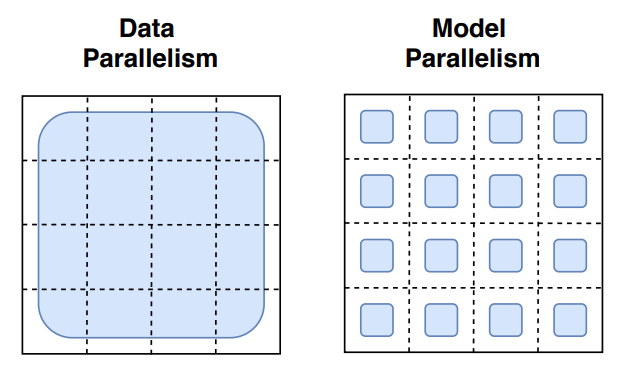

# Distributed Training with [Horovod][1]

---

#### Table of Contents

- [Distributed Training with Horovod](#distributed-training-with-horovod1)
  - Examples:
    - [Tensorflow with Horovod](./tensorflow/README.md)
    - [PyTorch with Horovod](./torch/README.md)
  - [Model Parallelism and Data Parallelism](#model-parallelism-and-data-parallelism)
    + [Example](#example)
  - [Horovod Data Parallel Frameworks](#horovod-data-parallel-frameworks3)
    + [Tensorflow with Horovod](#tensorflow-with-horovod)
    * [PyTorch with Horovod](#pytorch-with-horovod)
  - [Handson](#handson)
  - [Additional References](#additional-references)

---

**Author**: Sam Foreman ([foremans@anl.gov](mailto:foremans@anl.gov))

**Note**:  Adapted from original material [here](https://github.com/argonne-lcf/sdl_ai_workshop/blob/master/01_distributedDeepLearning/Horovod/README.md), written by __[Huihuo Zheng](mailto:huihuo.zheng@anl.gov)__ and __[Corey Adams](mailto:corey.adams@anl.gov)__.

**Goal:**

1. Understand how to run jobs on Theta / ThetaGPU
2. Get familiar with the software frameworks on Theta / ThetaGPU
3. Understand Data Parallelism (scaling efficiency, warmup, etc)
4. Know how to modify your code with Horovod

**Examples:**

1. [Tensorflow with Horovod](./tensorflow/README.md)
2. [PyTorch with Horovod](./torch/README.md)

---

## Model Parallelism and Data Parallelism

1. **Model parallelization:** In this scheme, disjoint subsets of a neural network are assigned to different devices. Therefore, all the computation associated with the subsets are distributed. Communication happens between devices whenever there is dataflow between two subsets. Model parallelization is suitable when the model is too large to fit into a single device (CPU/GPU) because of the memory capacity. However, partitionining the model into different subsets is not an easy task, and there might potentially introduce load imbalance issues limiting the scaling efficiency.
2. **Data parallelization:** In this scheme, all of the workers own a replica of the model. The global batch of data is split into multiple minibatches and processed by different workers. Each worker computes the corresponding loss and gradients with respect to the data it possesses. Before the updating of the parameters at each epoch, the loss and gradients are averaged among all the workers through a collective operation. This scheme is relatively simple to implement. `MPI_Allreduce` is the only communication operation required.
   1. Our recent presentation about the data parallel training can be found here: https://youtu.be/930yrXjNkgM

### Example:

- How the model **weights** are split over cores ([image credit][2]):

  - Shapes of different sizes in this row represent larger weight matrics in the networks' layers.

  

- How the **data** is split over cores:

  

<!------>

## [Horovod Data Parallel Frameworks][3]

[1]: https://github.com/horovod/horovod
[2]: https://venturebeat.com/2021/01/12/google-trained-a-trillion-parameter-ai-language-model/
[3]: https://horovod.readthedocs.io/en/stable/

## Handson

- [`./thetagpu.md`](./thetagpu.md)
- [`./theta.md`](./theta.md)

## Additional References

1. https://github.com/horovod/horovod
2. https://horovod.readthedocs.io/en/stable/
3. https://venturebeat.com/2021/01/12/google-trained-a-trillion-parameter-ai-language-model/
4. Sergeev, A., Del Balso, M. (2017) Meet Horovod: Uber’s Open Source Distributed Deep Learning Framework for TensorFlow. Retrieved from https://eng.uber.com/horovod/
5. Sergeev, A. (2017) Horovod - Distributed TensorFlow Made Easy. Retrieved from https://www.slideshare.net/AlexanderSergeev4/horovod-distributed-tensorflow-made-easy
6. Sergeev, A., Del Balso, M. (2018) Horovod: fast and easy distributed deep learning in TensorFlow. Retrieved from arXiv:**1802.05799**