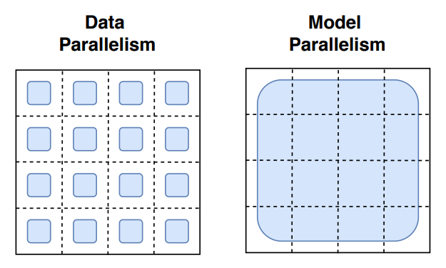

# Distributed Training with Horovod

---

#### Table of Contents

- [Distributed Training with Horovod](#distributed-training-with-horovod)
  * [Model Parallelism and Data Parallelism](#model-parallelism-and-data-parallelism)
    + [Detailed Description](#detailed-description)
    + [Internal Mechanics](#internal-mechanics)
  * [Additional References](#additional-references)

- Examples:
  - [Tensorflow with Horovod](./tensorflow/README.md)
  - [PyTorch with Horovod](./torch/README.md)

---

**Author**: Sam Foreman ([foremans@anl.gov](mailto:foremans@anl.gov))

**Note**:  Adapted from original material [here](https://github.com/argonne-lcf/sdl_ai_workshop/blob/master/01_distributedDeepLearning/Horovod/README.md), written by Huihuo Zheng ([huihuo.zheng@anl.gov](mailto:huihuo.zheng@anl.gov)) and Corey Adams ([corey.adams@anl.gov](mailto:corey.adams@anl.gov)).

Additional examples / information can be found [here](https://github.com/argonne-lcf/sdl_ai_workshop/blob/master/01_distributedDeepLearning/README.md)

**Goal:**

2. Get familiar with Data Parallelism and Model Parallelism
2. Understand the differences between Data vs. Model Parallelism
3. Know how to modify your code to work with Horovod

**Examples:**

1. Tensorflow
   1. [`README.md`](./tensorflow/README.md)
   2. [`tensorflow/tf2_hvd_mnist.py`](./tensorflow/tf2_hvd_mnist.py)
2. PyTorch
   1. [`README.md`](./torch/README.md)
   2. [`torch/torch_hvd_mnist.py`](./torch/torch_hvd_mnist.py)

---

## Model Parallelism and Data Parallelism

1. **Model parallelization:** 

   - In this scheme, disjoint subsets of a neural network are assigned to different devices. Therefore, all the computation associated with the subsets are distributed. 
   - Communication happens between devices whenever there is dataflow between two subsets. 
   - Model parallelization is suitable when the model is too large to fit into a single device (CPU/GPU) because of the memory capacity. 
     - However, partitionining the model into different subsets is not an easy task, and there might potentially introduce load imbalance issues limiting the scaling efficiency.

2. **Data parallelization:** 

   - In this scheme, all of the workers own a replica of the model. 
   - The global batch of data is split into multiple minibatches and processed by different workers. 
   - Each worker computes the corresponding loss and gradients with respect to the data it possesses. 
   - Before the updating of the parameters at each epoch, the loss and gradients are averaged among all the workers through a collective operation. 
     - This scheme is relatively simple to implement. `MPI_Allreduce` is the only communication operation required.

   - Our recent presentation about the data parallel training can be found here: https://youtu.be/930yrXjNkgM

([image credit](https://horovod.readthedocs.io/en/stable/))

### Detailed Description

- [image credit](https://arxiv.org/pdf/2101.03961.pdf)

- How the model **weights** are split over cores

  - **Data Parallelism**: Each worker maintains their own _complete_ copy of the model and its weights.

  - **Model Parallelism**: Each worker receives a _unique subset_ of the model weights. This is useful in the case where our model is too large to fit on a single worker.

    

- How the **data** is split over cores:

  - **Data Parallelism**: Each worker receives a _unique subest_ of the dataset.
  - **Model Parallelism**: Each worker receives their own *complete copy* of the dataset. 
  
  

### Internal Mechanics

- [image credit](https://horovod.readthedocs.io/en/stable/)

## Additional References

1. https://github.com/horovod/horovod
2. https://horovod.readthedocs.io/en/stable/
3. https://venturebeat.com/2021/01/12/google-trained-a-trillion-parameter-ai-language-model/
4. Sergeev, A., Del Balso, M. (2017) Meet Horovod: Uber’s Open Source Distributed Deep Learning Framework for TensorFlow. Retrieved from https://eng.uber.com/horovod/
5. Sergeev, A. (2017) Horovod - Distributed TensorFlow Made Easy. Retrieved from https://www.slideshare.net/AlexanderSergeev4/horovod-distributed-tensorflow-made-easy
6. Sergeev, A., Del Balso, M. (2018) Horovod: fast and easy distributed deep learning in TensorFlow. Retrieved from arXiv:**1802.05799**