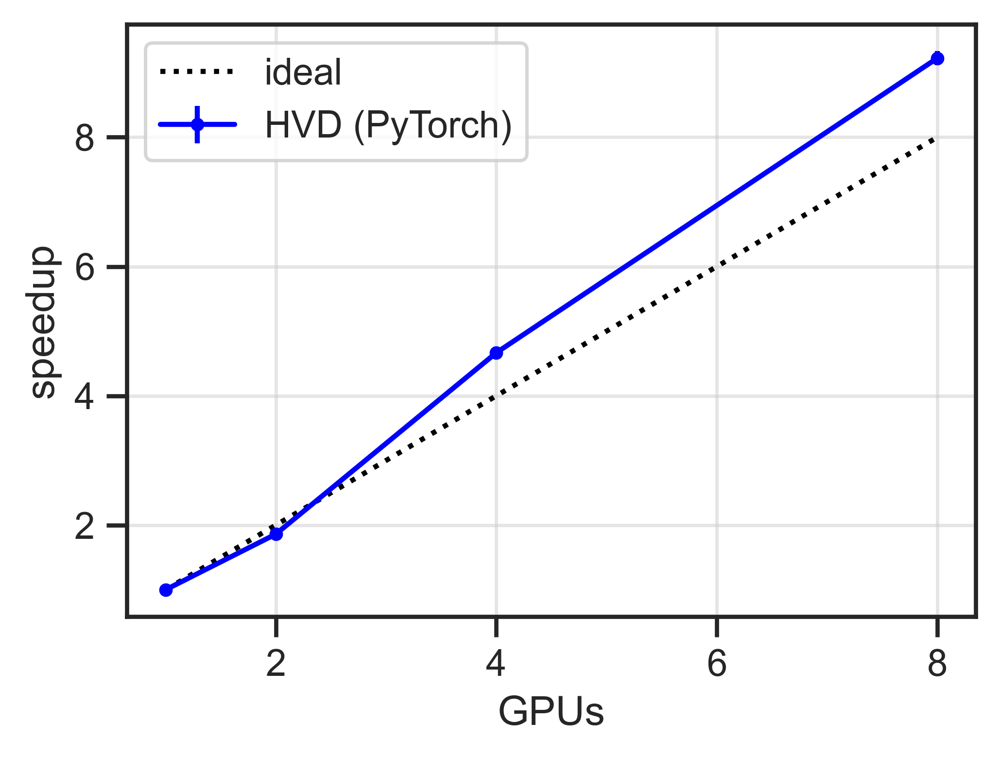

# PyTorch with Horovod

#### Table of Contents

- [PyTorch with Horovod](#pytorch-with-horovod)
      - [Table of Contents](#table-of-contents)
  * [Results](#results)
  * [Running on ThetaGPU](#running-on-thetagpu)

---

**Note:** We provide an example script, available here: [./horovod/torch/torch_hvd_mnist.py](./torch/torch_hvd_mnist.py)

Using Horovod + PyTorch is similar to the procedure described for TensorFlow, with some minor modifications.

Below we describe each of the steps necessary to use Horovod for distributed data-parallel training using `pytorch`

- **Goal:** 
  1. Understand how Horovod works with PyTorch
  2. Be able to modify existing code to be compatible with Horovod

---

1. **Initialize Horovod**

   After this initialization, the rank ID and the number of processes can be referred to as `hvd.rank()` and `hvd.size()`. Additionally, we can also call `hvd.local_rank()` to get the local rank ID within a node. This is useful when we are trying to assign GPUs to each rank.

   ```python
   import horovod.torch as hvd
   
   hvd.init()
   local_size = hvd.local_rank()
   world_size = hvd.size()
   ```

2. **Assign GPUs to each rank**

   In this case, we set one GPU per process: ID = `hvd.local_rank()`

   ```python
   if torch.cuda.is_available():
       device = torch.device(f'cuda:{hvd.local_rank()}')
       torch.cuda.set_device(device)
   ```

3. **Scale the learning rate**

   If we are using `n` workers, the global batch usually increases `n` times. The learning rate should increase proportionally as follows

   ```python
   from torch import optim
   optimizer = optim.SGD(model.parameters(), lr=args.lr * hvd.size(), momentum=args.momentum)
   ```

4. **Wrap the optimizer with `hvd.DistributedOptimizer`**

   ```python
   compression = (
       hvd.Compression.fp16 if args.fp16_allreduce else hvd.Compression.none
   )
   optimizer = hvd.DistributedOptimizer(optimizer,
                                        compression=compression,
                                        named_parameters=model.named_parameters())
   ```

5. **Broadcast the model from rank 0**

   This ensures all workers start from the same point.

   ```python
   hvd.broadcast_parameters(model.state_dict(), root_rank=0)
   hvd.broadcast_optimizer_state(optimizer, root_rank=0)
   ```

6. **Loading data according to the rank ID**

   One minor difference from the TensorFlow example is that PyTorch has some internal functions for dealing with parallel distribution of data.

   **Note**: We provide a helper function `prepare_datasets` in [`05_scaling-DL/utils/data_torch.py`](../utils/data_torch.py) that takes care of initializing the necessary dataset objects.
   
   ```python
   transform = transforms.Compose([
       transforms.ToTensor(), transforms.Normalize((0.1307,), (0.3081,))
   ])
   train_dataset = datasets.MNIST('datasets/', train=True, download=True, transform=transform)
   train_sampler = torch.utils.data.distributed.DistributedSampler(
       train_dataset,
       num_replicas=hvd.size(),
       rank=hvd.rank()
   )
   train_loader = torch.utils.data.DataLoader(
   	train_dataset, batch_size=args.batch_size, sampler=train_sampler, **kwargs
   )
   ```

   In both cases, the total number of steps per epoch is `nsamples / hvd.size()`.
   
7. **Checkpointing _only_ from root rank**

   It is important to only let one process be responsible for checkpointing I/O to prevent race conditions which might jeopardize the integrity of the checkpoint.

   ```python
   if hvd.rank() == 0:
       checkpoint.save(checkpoint_dir)
   ```

8. **Average metrics across all workers**

   Notice that in the distributed training, any tensors are local to each worker. In order to get the global averaged value, we can use `hvd.allreduce`. Below we provide an example

   ```python
   def metric_average(x, name):
       if isinstance(x, torch.Tensor):
           tensor = x.clone().detach()
       else:
           tensor = torch.tensor(x)
       
       avg_tensor = hvd.allreduce(tensor, name=name)
       return avg_tensor.item()
   ```

## Results

**PyTorch**: Single node (up to 8 GPUs)



**PyTorch** (time for 32 epochs)

| GPUs | cifar10 (s) | MNIST (s) |
| :--: | :---------: | :-------: |
|  1   |    522.3    |   499.8   |
|  2   |    318.8    |   283.9   |
|  4   |    121.4    |   100.4   |
|  8   |    73.5     |   58.8    |
|  16  |    79.1     |   63.8    |
|  32  |    81.1     |   55.7    |

## Running on ThetaGPU

1. Login to Theta:

   ```bash
   # to theta login node from your local machine
   ssh username@theta.alcf.anl.gov
   ```

2. Login to ThetaGPU service node (this is where we can submit jobs directly to ThetaGPU):

   ```bash
   # to thetaGPU service node (sn) from theta login node
   ssh username@thetagpusn1
   ```

3. Submit an interactive job to ThetaGPU

   ```bash
   # should be ran from a service node, thetagpusn1
   qsub -I -A Comp_Perf_Workshop -q training -n 1 -t 00:30:00 -O ddp_tutorial --attrs=pubnet=true
   ```

4. Once your job has started, load the `conda/pytorch` module and activate the base conda environment

   ```bash
   module load conda/pytorch
   conda activate base
   ```

5. Clone the `CompPerfWorkshop-2021` github repo (if you haven't already):

   ```bash
   git clone https://github.com/argonne-lcf/CompPerfWorkshop-2021
   ```

6. Download the MNIST dataset using the provided script:

   ```bash
   cd CompPerfWorkshop-2021/05_scaling-DL
   # Download the MNIST dataset
   ./download_mnist.sh
   ```

7. Navigate into the `horovod/torch/` directory and run the example:

   ```bash
   cd horovod/torch
   mpirun -np 8 --verbose python3 ./torch_hvd_mnist.py --batch_size=256 --epochs=10 > training.log&
   ```