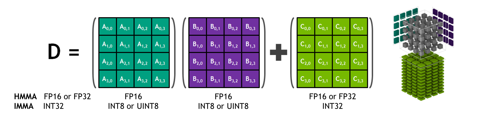
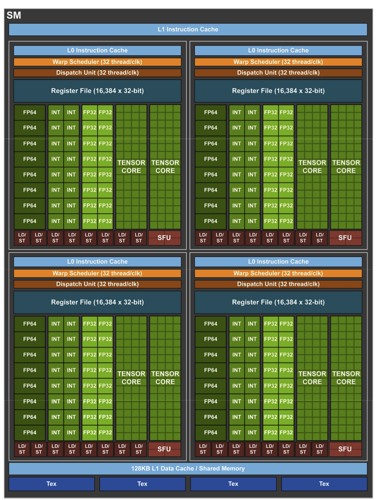
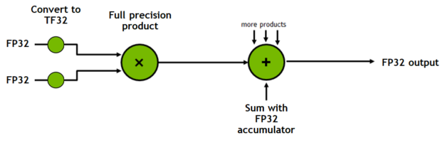
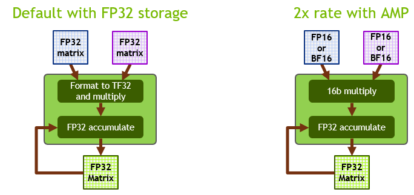
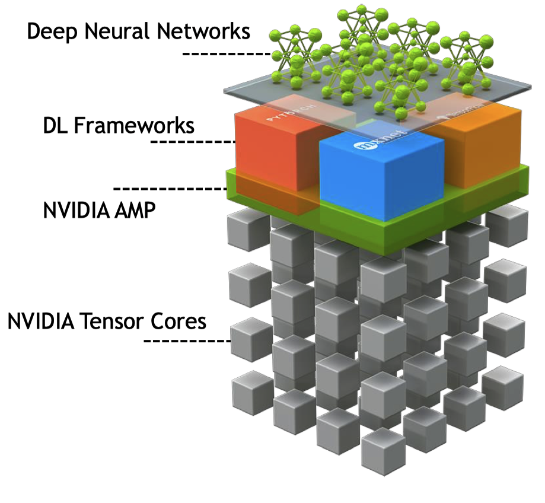
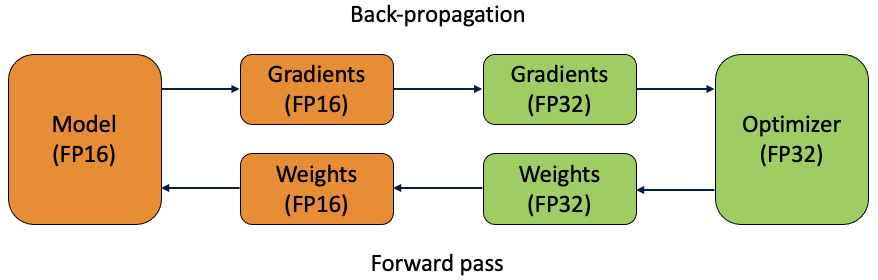
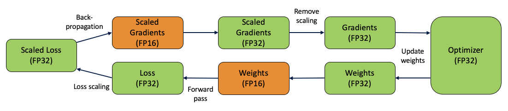

# Reduced and Mixed Precision

The use of single precision (`float32`) instead of double precision (`float64`) floating
point quantities in simulation has long been used to accelerate scientific software (and
reduce energy consumption), when the corresponding loss in accuracy can be tolerated. The
design of modern CPUs and GPUs (and their memory subsystems) often means that a near 2x
speedup can be achieved simply by replacing all `double` variables with `float`.
Twice as many values can fit into the vector registers, and memory, memory bandwidth, and
cache pressure are all halved.
<!-- FPU add, multiply, ... should be roughly the same for single and double precision
in x86-64
https://stackoverflow.com/questions/4584637/double-or-float-which-is-faster
https://stackoverflow.com/questions/3426165/is-using-double-faster-than-float
-->

In the realm of deep learning, this strategy has enjoyed great success and has been
extended to more extreme forms of reduced precision, incluidng half precision (`float16`),
integer precision (`int8`, `int4`, `int1`), and custom types and modes designed for
machine learning: "(Google) Brain floating point format" (`bfloat16`) and TensorFloat-32
(`tf32`).

<!-- TensorFloat-32 is not really a floating point format or type, but rather a Tensor 
Core mode. See 2020 talk by Dusan Stosic -->

Deep learning models are often highly tolerant of reduced floating point precision during
training, and their model weights can typically be quantized to integers during inference
(after training).

Mixed precision, as the name implies, mixes variables of reduced and possibly single
precision in a single operation.

This presentation will discuss the use of reduced and mixed precison in TensorFlow and
PyTorch and explore the profiling of the models on the A100 GPUs on ThetaGPU.

## References

- [ECCV 2020 Tutorial: Accelerating Computer Vision with Mixed Precision](https://nvlabs.github.io/eccv2020-mixed-precision-tutorial/)

- [NERSC SC20 Tutorial: Deep Learning at
  Scale](https://github.com/NERSC/sc20-dl-tutorial#enabling-mixed-precision-training)

- 2021 ALCF GPU Hackathon: DLProf tutorial
  
## Tensor Core utilization and changes in A100s

<!-- KGF: certain dims need to be a multiple of 8 to be TC-compatible; but does the A100 TC look different in this picture?
 Why 8, when the matrices are 4x4? -->

|| V100  | A100 |
|-------|:-------------:|:-------------:|
| CUDA Cores | 5120  | 6912  |
| Tensor Cores (TC) | 640  | 432  |
| TC modes | fp16 | fp16, bfloat16, tf32, fp64 | 

\* and `int8, int4, int1` for both generations. 

The 16:1 ratio of CUDA cores to Tensor cores in the Ampere SM and the 8:1 ratio in the
Volta SM are evident from their layouts:

### GA100 SM

### GV100 SM

While there are half as many TC per CUDA cores in the Ampere architecture, they are much
more useful. 

### Tensor Float 32 (TF32) mode
This is the default math mode for single precision training on A100s.

Given two `float32` operand matrices, TF32 mode formats the operand entries to 19-bit
(sign bit + 8 bits exponent + 10 bits significand) TF32 and multiplied.  This mode
provides the range of `float32` (8-bit exponent) with the precision of `float16` (10-bit
significand). The multiplications are accumulated in the `float32` matrix output of the
Tensor Core. 

<!-- The tensor cores will receive IEEE 754 FP32 numbers.
The tensor cores will convert the FP32 numbers into TF32 by reducing the mantissa to 10-bits.
The multiply step will be performed in TF32.
The accumulate step will be performed in standard FP32, resulting in an IEEE 754 FP32
tensor output.
-->

You can disable it at the system level via environment variable `NVIDIA_TF32_OVERRIDE=0`, 
but:
> it must be set before the application is launched, as the effect of any change after the
application launch is unspecified. The variable affects only the mode of FP32
operations. Operations using FP64 or one of the 16-bit formats are not affected and
continue to use those corresponding types.

## Automatic mixed precision (AMP)

NVIDIA started publishing their techniques on mixed precision training in mid 2017. Note,
the V100 was released on 2017-12-07. Micikevicius and Narang (ICLR 2018) was released in
May the next year, and the NVIDIA Apex ("A PyTorch Extension") library, with its AMP module, was released in June
at CVPR 2018. Most of Apex was moved upstream into PyTorch in 2020. 
<!-- https://developer.nvidia.com/blog/mixed-precision-training-deep-neural-networks/ -->
<!-- https://developer.nvidia.com/blog/apex-pytorch-easy-mixed-precision-training/ -->

Announced at GTC 2019 (and first available in the 19.03 NGC container) for TensorFlow,
NVIDIA's AMP tool made what was originally a manual, labor-intensive process of variable
casting and optimizer tuning in TensorFlow very easy. "NVIDIA AMP" is now used to refer to
the collection of cuBLAS, cuDNN, etc. library calls which target TCs and the associated
techniques for stable mixed precision training implemented in the separate frameworks. 
<!-- i.e. it is not an actual standalone library -->

The mixed precision training (vs. `float16` training) continues to store the copies of the
model weights in single precision `float32`. However, during training some of these
weights are down-casted to `float16` to be used in the actual calculations. 

Really need a GPU with compute capability >= 7.0 (aka those with TCs) to benefit from
mixed precision, but other GPUs and models might benefit from the decrease in memory
and bandwidth usage. 

<!--  Computations are done in float16 for performance, but variables must be kept in float32 for numeric stability. -->
Convolution and matrix multiplication are performance critical operations that can benefit
from being computed in `float16` while also remaining numerically stable. Most
activiation functions are also safe to perform in half precision.

Other operations should alwyas be done in `float32` for numerical stability concerns,
since they either require the larger range and/or precision: pointwise operaitons like
`exp`, loss function, optimizer (Adam), batch norm, softmax. 

<!-- ### Gradient clipping -->

## Loss scaling

A well-studied problem in deep learning is vanishing gradients. The limited range of the
`float16` half precision format means that this problem is exacerbated, specifically for
the activation gradients (weights, weight gradients, and activations are less
susceptible). Smallest normalized value `min(float16) = 0.00006103515625` whereas
`min(float32) = 1.175494 x 10^{-38}`. 
<!-- 2^-14 for float16, but can represent down to 2^-24 denormalized -->
<!--- is that the correct explanation? a bit more complicated in mixed precision; are the -->
<!--grads stored in float16??? multiplied by small learning rate -->
<!-- https://towardsdatascience.com/understanding-mixed-precision-training-4b246679c7c4 -->

If we multiply the loss after a forward pass by a constant factor, the corresponding
gradients are also scaled by this factor (see chain rule).

Loss scaling is an essential technique for stable training when using mixed precision in
some networks.

### Without loss sclaing

### With loss scaling

## Hands-on AMP in deep learning frameworks: TensorFlow and PyTorch

Enablilng automatic `float16`/`float32` mixed precision in TensorFlow and PyTorch only
requires changes to a few lines of code, as shown in the previous section for TensorFlow
[Profiling: reduced precision](../09_profiling_frameworks/README.md).

Currently, `bfloat16` support is unavailable for NVIDIA GPUs in either TensorFlow and
PyTorch. However, TensorFlow supports automatic `bfloat16`/`float32` mixed precision for
Google TPUs. cuDNN has some convolutions with `bfloat16` now but it has not yet been
natively integrated into the production framework branches.

Continue on to the subfolders for more framework-specific details:
- [TensorFlow](./TensorFlow/README.md)
- [PyTorch](./PyTorch/README.md)

