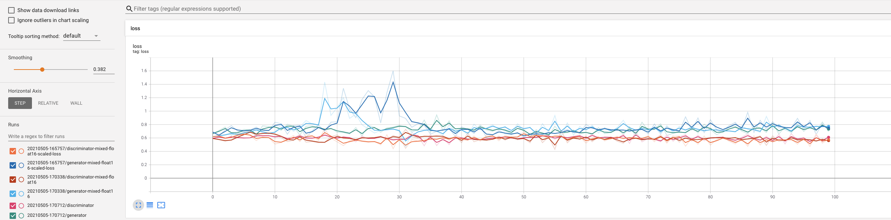
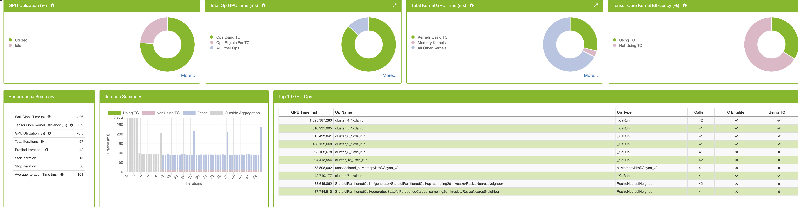
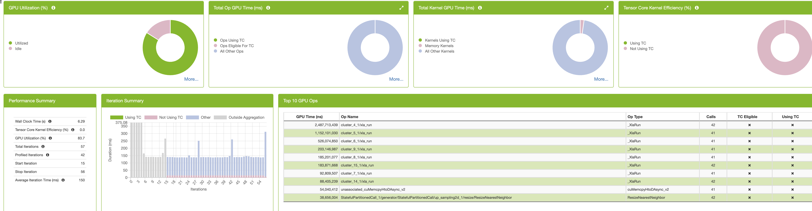
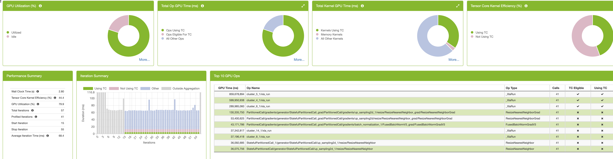
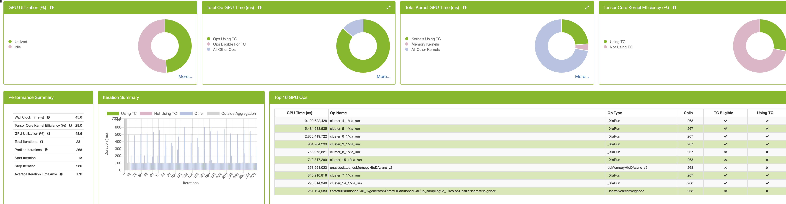
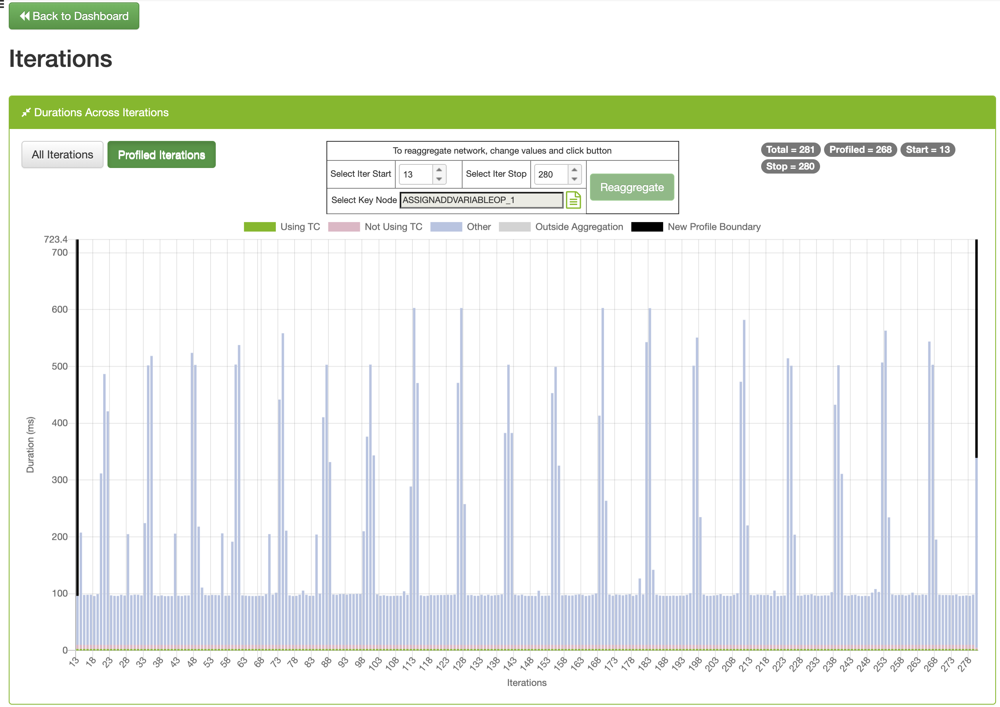

# Mixed Precision in TensorFlow

Here we will build on the GAN example from the previous TensorFlow profiling module.  We
will by default run the training for 4 epochs, each consisting of 14 iterations when the
batch size is 4096.

We will use the April 2021 release NVIDIA-optimiized NGC Singularity container for
TensorFlow 2.x in this walkthrough:
```
singularity exec --nv -B /lus /lus/theta-fs0/software/thetagpu/nvidia-containers/tensorflow2/tf2_21.04-py3.simg bash
```
Note, this is different from the custom-built container from the previous TensorFlow
module, which had additional profiling tools and plugins installed (and has some issues
when trying to disable TensorFloat-32 mode).
<!-- ```
singularity exec --nv -B /lus /grand/projects/Comp_Perf_Workshop/containers/tf2_cpw.simg bash
``` -->

## Custom loss scaling

When discussing [reduced precision](../../09_profiling_frameworks/TensorFlow/reduced_precision/README.md) in the
profiling module, it was claimed that only one additional line was necessary to enable
mixed precision in Keras. That was not quite true; since we only cared about raw
performance, we did not even consider the effects on model accuracy. In general, loss
scaling is a necessary addition to your deep learning code in order to ensure
that mixed precision does not harm training. 
In [`train_GAN_optimized.py`](train_GAN_optimized.py), 
we have added a switch `use_scaled_loss` at the top of the file to enable loss scaling, which does the
following:
1. Scale up the loss by the adaptive factor during the forward pass:
```python
        #Update the generator:
        with tf.GradientTape() as tape:
                loss = forward_pass(
                    models["generator"],
                    models["discriminator"],
                    _input_size = 100,
                    _real_batch = data,
                )
				# new line; not used if use_scaled_loss=False
                scaled_gen_loss = _opts["generator"].get_scaled_loss(loss['generator'])
```
2. Undo the gradient scaling and apply the unscaled gradient updates to the model weights
```python
        # Apply the update to the network (one at a time):
        if use_scaled_loss:
            scaled_grads = tape.gradient(scaled_gen_loss, trainable_vars)
            grads = _opts["generator"].get_unscaled_gradients(scaled_grads)
        else:
            grads = tape.gradient(loss["generator"], trainable_vars)

        _opts["generator"].apply_gradients(zip(grads, trainable_vars))
```
The same changes are applied to the discriminator training, too.

And the optimizer objects must be wrapped in a `LossScaleOptimizer()` class:
```python
    opts = {
        "generator" : tf.keras.mixed_precision.LossScaleOptimizer(tf.keras.optimizers.Adam(0.001)),
        "discriminator" : tf.keras.mixed_precision.LossScaleOptimizer(tf.keras.optimizers.RMSprop(0.0001))
    }
```

We have also added a few quality-of-life improvements to this script, including:
- A switch at the top of the file to activate `float16` mixed precision
- TensorBoard logging of discriminator and generator loss, per epoch

Let's compare the loss curves with and without loss scaling:
```
# float32, no loss scaling
python train_GAN_optimized.py

# edit file, set use_mixed_precision=True
# float16, no loss scaling
python train_GAN_optimized.py

# edit file, set use_scaled_loss=True
# float16, w/ loss scaling
python train_GAN_optimized.py

tensorboard --logdir logs/
```
Connect to the TensorBoard process from you local machine by following [ThetaGPU: TensorBoard Instructions](https://argonne-lcf.github.io/ThetaGPU-Docs/ml_frameworks/tensorflow/tensorboard_instructions/)
or copy the directory to your local machine.

In the GAN, it shouldn’t make as big of a difference since the loss never gets so low that
you get near the clipping range, but it could matter.


How do you know a GAN has converged? The loss curves are never exactly duplicated. 
You are really looking to see that one isn’t “winning” and the losses both remain 
around the same order of magnitude. That is evident in all three cases above (mixed
precision, no loss scaling; mixed precsiion with loss scaling, `float32`). 

So a GAN was not the best example to illustrate loss scaling. But certainly LSTMs are more
vulnerable to these concerns, as shown in this example from NVIDIA which plots the model
perplexity as a function of training interation:


NVIDIA notes that many networks train out-of-the-box without loss scaling, however. 

### `tf.keras.Model.fit`

> If you use `tf.keras.Model.fit`, loss scaling is done for you so you do not have to do any extra work. If you use a custom training loop, you must explicitly use the special optimizer wrapper `tf.keras.mixed_precision.LossScaleOptimizer` in order to use loss scaling.


## Manual profiling
If you grabbed a full DGX node, let's exclude all but one A100 GPU, since we are not
considering distributed training:
```
export CUDA_VISIBLE_DEVICES=0
```
By default, TensorFlow will allocate memory on every visible GPU, and the diagnostics for
the unused GPUs will annoyingly clog `STDOUT`. 

First, let's check the importance of TF32 mode.

With `use_mixed_precision=False` at the top of the file so that operands are all single
precision, execute the code with TF32 disabled at the system level:
```
NVIDIA_TF32_OVERRIDE=0 python train_GAN_optimized.py
```
Note, even with TF32 disabled, TensorFlow diagnostics (erroneously?) report:
```
2021-05-05 15:42:04.684246: I tensorflow/stream_executor/cuda/cuda_blas.cc:1838] TensorFloat-32 will be used for the matrix multiplication. This will only be logged once.
```
NVIDIA is aware of this anomaly and is looking into it (maybe TensorFlow still tries TF32
cuBLAS calls, even though they are disabled at this lower level?). Regardless of the
TensorFlow log, we will now see definitive evidence that TF32 is actually disabled.

We recall that we achieved 90-100K img/s with TF32 enabled. The throughput drops by 33%
when none of the `float32` operands are able to utilize any of the 492 TCs:
```
...
2021-05-05 04:30:05,967 - INFO - (2, 13), G Loss: 0.699, D Loss: 0.612, step_time: 0.129, throughput: 63603.233 img/s.
2021-05-05 04:30:06,212 - INFO - (3, 0), G Loss: 0.698, D Loss: 0.615, step_time: 0.129, throughput: 63499.559 img/s.
2021-05-05 04:30:06,351 - INFO - (3, 1), G Loss: 0.700, D Loss: 0.615, step_time: 0.129, throughput: 63326.235 img/s.
2021-05-05 04:30:06,490 - INFO - (3, 2), G Loss: 0.698, D Loss: 0.618, step_time: 0.129, throughput: 63691.775 img/s.
```

Note, `NVIDIA_TF32_OVERRIDE=0` will have no effect in this example if
`use_mixed_precision=True`, since the Tensor cores can take `float16` inputs and output
`float16` matrices without using a TF32 intermediate format.


## NVIDIA DLProf

`nvidia-smi` has no way of showing Tensor Core utilization. Nor is it really exposed in
Nsight Systems. 

For deep learning software, we can use DLProf to profile TC utilization and more. 
This software lives on top of the Nsight Systems and Nsight Compute profilers. The results
can be dumped to CSV and/or visualized in TensorBoard. You can correlate GPU performance
with the model timeline. All you have to do (in theory) is preface your normal command
with `dlprof`. However, there are a few options and tweaks that are really necessary to
get useful profiling info out of it.

First, let's collect basic statistics using Simple Mode. With `float32` set in our code
(`use_mixed_precision=False`) and XLA with TF32 active:
```
> dlprof --mode=simple python train_GAN_optimized.py
...
     Wall Time: 40.41 s
Total GPU Time: 17.09 s
   TC GPU Time:  2.64 s
```

Next, disable TF32 again:
```
> NVIDIA_TF32_OVERRIDE=0 dlprof --mode=simple python train_GAN_optimized.py
...
     Wall Time: 41.94 s
Total GPU Time: 19.60 s
   TC GPU Time:  1.22 s
```
This confirms our assumption: enabling TensorFloat-32 leads to greater Tensor Core
utilization and faster time to solution when using single precision training. The simple
mode diagnostics are useful to quickly confirm that your code is taking advantage of the
Tensor Cores.

Finally, check mixed precision after editing the file to flip the switch:

```
> dlprof --mode=simple python train_GAN_optimized.py
...
     Wall Time: 48.08 s
Total GPU Time: 26.88 s
   TC GPU Time:  1.80 s
```

It seems counter-intuitive that mixed precision took the longest wall and GPU time,
especially since it posted the largest img/sec throughput on the `STDOUT`
diagnostics. However, you may have noticed that the initial iterations in this mode are
particularly slow. Let's now move to the full profile to understand this.


### Default `--mode=tensorflow2` full profiling

The framework-dependent modes require NVTX annotation markers embedded in the framework
source code. 

In TensorFlow 2.x, there is no universal marker for the beginning/end of a training
interation. Therefore, we must specify an operation ("node") which demarcates the
iteration boundary. Use the `--key_node` flag; [this
documention](https://docs.nvidia.com/deeplearning/frameworks/dlprof-user-guide/#find_good_key_node)
describes a two-step process for determining a good node/op. 

Also, we want to exclude the first handful of training iterations from profiling
statistics, since they are always slower due to XLA compilation, cuDNN heuristics, etc.:

```
dlprof --key_node=ASSIGNADDVARIABLEOP_1 --iter_start=15 python train_GAN_optimized.py
```

Note, `dlprof` will not complete successfully if you send `SIGINT` to your application. I
have also found that `--iter_stop` caused issues in the environment / with this particular
version. If you are on a single GPU interactive job, the profiler might fail to detect
AMP. 

Again, we repeat 

#### `float32`, XLA, TF32



Each end of an epoch is visible in the iteration bar chart. 

#### `float32`, XLA, disabled TF32



#### Mixed precision, XLA



DLProf suggests increasing the batch size, since we are using <20% of the GPU memory. With
mixed precision training, we are able to scale the GAN training up to a batch size of
32,768 images on the 40 GiB A100. The throughput is somewhat worse, however (85k
img/s). The GAN model is relatively small, so we arent able to push this further.

### Pitfall: incompatible tensor sizes

One of the most common mistakes when it comes to using Tensor Cores is using layer sizes
which are incompatible with Tensor Core primitives.

From [NVIDIA's Deep Learning Performance
Documentation](https://docs.nvidia.com/deeplearning/performance/mixed-precision-training/index.html):
> cuDNN v7 and cuBLAS 9 include some functions that invoke Tensor Core operations, for 
performance reasons these require that input and output feature map sizes are multiples
of 8. 

LSTM and Dense layers should have 8*L units, Convolutional layers should have 8*M filters,
and the batch size should be 8*N for optimal performance

<!-- Ensuring GPU Tensor Cores are used
As mentioned previously, modern NVIDIA GPUs use a special hardware unit called Tensor Cores that can multiply float16 matrices very quickly. However, Tensor Cores requires certain dimensions of tensors to be a multiple of 8. In the examples below, an argument is bold if and only if it needs to be a multiple of 8 for Tensor Cores to be used.

tf.keras.layers.Dense(units=64)
tf.keras.layers.Conv2d(filters=48, kernel_size=7, stride=3)
And similarly for other convolutional layers, such as tf.keras.layers.Conv3d
tf.keras.layers.LSTM(units=64)
And similar for other RNNs, such as tf.keras.layers.GRU
tf.keras.Model.fit(epochs=2, batch_size=128)
--> 

To illustrate this, let's mess up the generator network. First, we change the batch size
from 4096 to 4090.  Next, we change the number of filters in each convolutional and dense
layer from a multiple of 8 to an odd number, e.g.:

```
diff --git a/10_reduced-precision/TensorFlow/train_GAN_optimized.py b/10_reduced-precision/TensorFlow/train_GAN_optimized.py
index 3f933e6..f6163a3 100644
--- a/10_reduced-precision/TensorFlow/train_GAN_optimized.py
+++ b/10_reduced-precision/TensorFlow/train_GAN_optimized.py
@@ -211,7 +211,7 @@ class Generator(tf.keras.models.Model):
         #make it the right shape

         self.dense = tf.keras.layers.Dense(
-            units = 7 * 7 * 64  # 63
+            units = 7 * 7 * 63
         )

         # This will get reshaped into a 7x7 image with 64 filters.
@@ -224,7 +224,7 @@ class Generator(tf.keras.models.Model):

         self.generator_layer_1 = tf.keras.layers.Convolution2D(
             kernel_size = [5, 5],
-            filters     = 64,  # 63
+            filters     = 63,
             padding     = "same",
             use_bias    = True,
             activation  = activation,
@@ -241,7 +241,7 @@ class Generator(tf.keras.models.Model):

         self.generator_layer_2 = tf.keras.layers.Convolution2D(
             kernel_size = [5, 5],
-            filters     = 32,  # 31
+            filters     = 31,
             padding     = "same",
             use_bias    = True,
             activation  = activation,
@@ -257,7 +257,7 @@ class Generator(tf.keras.models.Model):

         self.generator_layer_3 = tf.keras.layers.Convolution2D(
             kernel_size = [5, 5],
-            filters     = 8,
+            filters     = 7,
             padding     = "same",
             use_bias    = True,
             activation  = activation,
@@ -291,7 +291,7 @@ class Generator(tf.keras.models.Model):


         # First Step is to to un-pool the encoded state into the right shape:
-        x = tf.reshape(x, [batch_size, 7, 7, 64])  # 63
+        x = tf.reshape(x, [batch_size, 7, 7, 63])

         x = self.batch_norm_1(x)
         x = self.generator_layer_1(x)
@@ -548,6 +548,6 @@ if __name__ == '__main__':
     rank, size = init_mpi()
     configure_logger(rank)

-    BATCH_SIZE=4096  # 4090
-    N_TRAINING_EPOCHS = 100 # 100
+    BATCH_SIZE=4090
+    N_TRAINING_EPOCHS = 20
     train_GAN(BATCH_SIZE, N_TRAINING_EPOCHS, size)
```	 






We can even identify when the generator is being trained (first half of each iteration)
vs. when the discriminator, which still has optimal layer sizes, is being trained within
each iteration.
